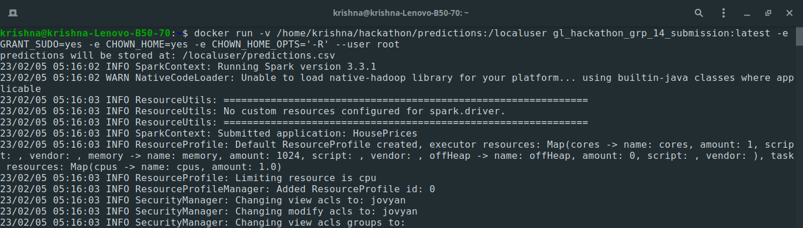
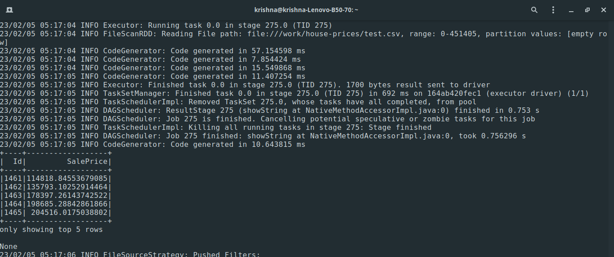

# Hackathon

# Group 14

### Housing price prediction  
Ask a home buyer to describe their dream house, and they probably won't begin with the height of the basement ceiling or the proximity to a north-south railroad. House price negotiations often have a lot of influencing factors and not just the number of bedrooms or the position of the kitchen.

Take the given dataset with 79 explanatory variables describing (almost) every aspect of residential homes in Ames, Iowa. In this hackathon, predict the final price of each home. 

The application should be modeled using Machine Learning, you may explore libraries such as PySpark. Apply containerization principles as a better software engineering practice. You may explore Kafka server for streaming the data.

The model can be deployed using Docker containers for scalability.

Dataset: https://www.kaggle.com/c/house-prices-advanced-regression-techniques/  

## Method and results

 - Develop machine learning model   
    1. To create a model that would predict house sale price based on the list of 79 features(excluding Id and SalePrice).
    2. To process the datasets we have used pyspark.On examination of data we decided to define schema to ensure data integrity of train and test datasets.
    3. EDA was done by  converting pyspark dataframe into pandas dataframe and seaborn was used for plotting charts.
    4. Spark MLLIB's Linear Regression model was used for creating model.
    5. **Engineering practices**:  
        1. For development, to ensure all group members use same softwares,dependencies and versions.We used docker image *jupyter/all-spark-notebook* from [docker](https://hub.docker.com/)  
        2. To create deployment image, we used docker image *jupyter/pyspark-notebook:latest* from [docker](https://hub.docker.com/) 
        3. The training data has 1460 entries, we used synthetic data generation using sdv to have additional training data.

## Docker    
### Installing pyspark from  docker container image 
1. Open docker hub and search for jupyter/all-spark-notebook.
2. Copy the Docker Pull Command-> docker pull jupyter/all-spark-notebook.
3. Execute the above command in the terminal to pull the image to your local machine.

### Steps to map container image for docker development container 
1. Below is the docker command that creates container and runs it 
    > docker run -d -p 8888:8888 -p 4040:4040 -p 4041:4041 -v /home/krishna/hackathon/work:/home/jovyan/work -e GRANT_SUDO=yes -e CHOWN_HOME=yes -e CHOWN_HOME_OPTS='-R' --user root --cpus="1.0" --memory="5g" --name gl_hackathon_grp_14 jupyter/all-spark-notebook
2. Option -V maps local directory to docker directory
3. Few other options are added as required due to local host machine limitations
4. To start docker, use **docker run -a gl_hackathon_grp_14**

## Repository(work) overview

Provides an overview of the directory structure(work) and files

├── README.md  
├── house-prices   
├── img   
├── lr_model.h5  
├── pipeline_model.h5  
├── Dockerfile  
├── generate_sdv.py  
├── model.py  
├── requirements.txt  
├── HOUSEPRICE.ipynb  
├── SDV_GENERATION.ipynb  
├── TRAINING.ipynb   
├── predictions.csv  

**house-prices** - directory containing training,synthentic training,testing datasets.  
**lr_model.h5** - persisted pyspark model.  
**pipeline_model.h5** - persisted pyspark pipeline model.  
**Dockerfile**  - docker file.  
**generate_sdv.py** - python module containing source code for generating synthentic datasets.   
**model.py** - python module containing source code for both training and test the model.  
-  *train_model()*: function loads training data, performs all data preprocessing steps,creates pipelines, trains the model and save pipeline and model.This function also has an option to include or exclude synthentic data.  
-  *test_model()*: function loads testing data, performs all data preprocessing steps,loads pipelines model,applies the model and performs prediction and saves the output as csv. 

**requirements.txt** - file contains python software pre-requistes used in the project.  

**HOUSEPRICE.ipynb** - Python notebook used for EDA, prototyping, training and demo of the model.  

**SDV_GENERATION.ipynb** - Python notebook used for prototyping of sythentic data generation. 

**predictions.csv** - Predictions generated using testing data.  

**img** - directory with images for documentation.

## Running instructions for ml model

1. Unzip the work file and open the terminal go to the work folder/directory.
2. docker build -t gl_hackathon_grp_14_submission and wait for build to complete.
3. Execute the below command
> docker run -v <local folder>:<docker folder> gl_hackathon_grp_14_submission:latest -e GRANT_SUDO=yes -e CHOWN_HOME=yes --user root  
 Example : docker run -v /home/krishna/hackathon/app_output:/localuser gl_hackathon_grp_14_submission:latest -e GRANT_SUDO=yes -e CHOWN_HOME=yes -e CHOWN_HOME_OPTS='-R' --user root
 4.On completion of the spark submit job, you should see the predictions.csv file in the local folder

Below are the snapshots of running the above container image.  
  

## About

This assignment is done by hackathon group 14  

## References
1. Material & Notebooks provided by Great Learning
2. Examples from Applied Data Science Using PySpark: Learn the End-to-End Predictive Model-Building Cycle
3. [spark by examples](https://sparkbyexamples.com/pyspark-tutorial/)
